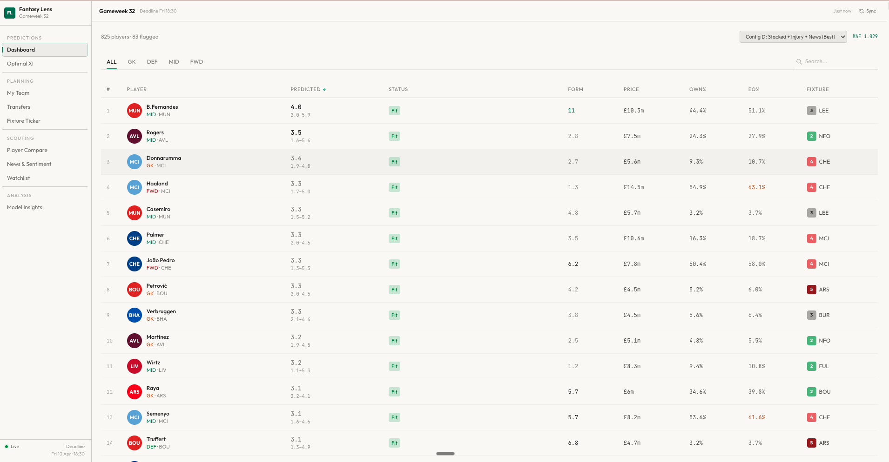
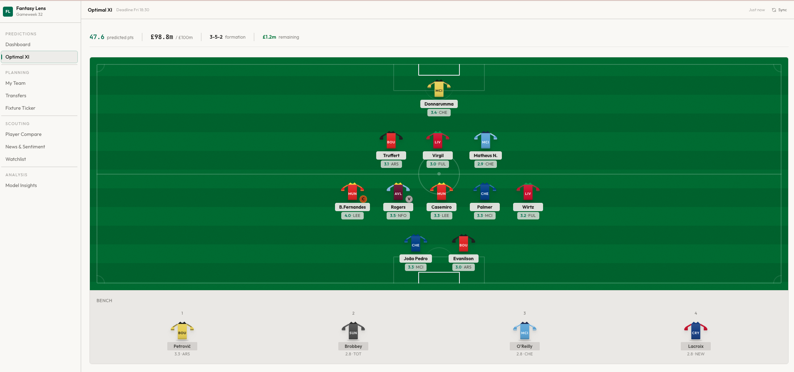
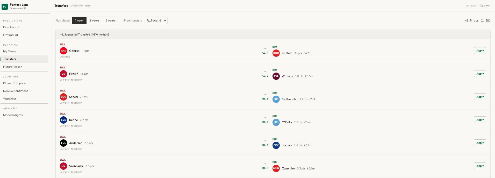

# FPLens

Predicts how many points every Fantasy Premier League player will score next gameweek, then turns those predictions into decisions: who to start, who to captain, who to transfer.



## What it does

- **Predicts** next-gameweek points for all ~800 players, each with a confidence range and a SHAP breakdown explaining *why*.
- **Builds squads**: integer linear programming picks the optimal 15 players within the £100m budget, position limits, and max-3-per-club rule, in under 200ms.
- **Plans transfers** over a 1–3 gameweek horizon, with a separately trained model for each horizon.

<details>
<summary>Screenshots</summary>




</details>

## Results

Trained on 8 Premier League seasons (2016-17 → 2023-24), evaluated on a held-out 2024-25 season the model never saw. Each config adds one data source to the same stacked ensemble.

| Config | Data | Features | Spearman ρ | MAE |
| ------ | ---- | -------- | ---------- | --- |
| A | FPL + Understat | 116 | 0.674 | 1.039 |
| B | + injury records | 148 | 0.685 | 1.032 |
| C | + Guardian news | 123 | 0.675 | 1.037 |
| **D** | **+ both** | **155** | **0.687** | **1.029** |

Injury and news interact: together they help more than the sum of adding each alone.

**Ranking quality (ρ) is the headline metric, not MAE.** 60% of player-gameweeks score zero, so MAE rewards predicting low regardless of skill, one model got the best MAE in the project by compressing every prediction toward zero, ranking a backup goalkeeper above Haaland. Picking a squad is a ranking problem, so ρ is what matters. [The full story →](docs/ARCHITECTURE.md#why-not-mae)

## Run it

```bash
git clone --recurse-submodules https://github.com/abdelmalek-maskri/fplens.git
cd fplens && python3 -m pip install -r requirements.txt && (cd app && npm install)

make dev     # API on :8000, dashboard on :5173
```

Trained models aren't committed (they're large and reproducible) — see [docs/RUNNING.md](docs/RUNNING.md) to obtain or rebuild them.

```bash
make test              # 78 Python tests
cd app && npm test     # 83 frontend tests
```

## How it works

Four data sources are merged into 155 features per player per gameweek: FPL match stats, Understat expected goals, injury records reconstructed from git history, and Guardian article sentiment. None of these share a common identifier, so linking them needed per-season team maps and a three-strategy name matcher.

Six diverse base learners (two LightGBMs, XGBoost, Random Forest, Ridge, and a classifier for whether a player features at all) are combined by inverse-MAE weighting. A FastAPI backend serves live predictions with a TTL cache; a React dashboard renders them.

Every rolling feature is computed with a one-gameweek lag, and injury snapshots are shifted forward a gameweek, so no feature uses information unavailable at prediction time.

## Docs

- [Architecture](docs/ARCHITECTURE.md): system design, API reference, model details
- [Running](docs/RUNNING.md): setup, models, environment variables
- [Pipeline order](docs/PIPELINE_ORDER.md): reproducing the data and models from scratch
- [Data sources](docs/DATA_SOURCES.md): attribution and licensing for every source

## Built with

Python · LightGBM · XGBoost · scikit-learn · SHAP · FastAPI · scipy (ILP) · React 19 · Vite · Tailwind

## Data and attribution

This is a non-commercial academic project. The football data belongs to its original owners:

- Historical FPL statistics from [vaastav/Fantasy-Premier-League](https://github.com/vaastav/Fantasy-Premier-League) (MIT), included as a git submodule
- Expected goals from [Understat](https://understat.com), via the [`understat`](https://github.com/amosbastian/understat) package
- Live data from the [Fantasy Premier League API](https://fantasy.premierleague.com/api/)
- Articles from [the Guardian Open Platform](https://open-platform.theguardian.com)

Full terms for each in [docs/DATA_SOURCES.md](docs/DATA_SOURCES.md). Not affiliated with or endorsed by the Premier League.

## Licence

Source code is [MIT](LICENSE). The licence covers this repository's code only — data
retrieved from third-party sources at build or run time remains subject to its own terms,
detailed in [docs/DATA_SOURCES.md](docs/DATA_SOURCES.md).
